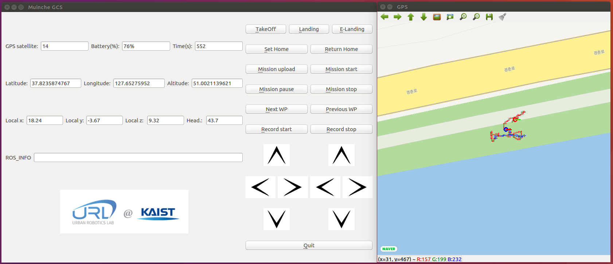

## 

#

Before you use this package as ros package, you need to follow some step below.

***
	<HOW-TO-USE GAZEBO-SITL-SIMULATION>
	1. Firmware directory or cd $(rospack find px4)(Firmware가 ROS package로 설정된 경우.)
	2. make px4_sitl_default
	3. cd (path of your catkin workspace) && catkin_make
	4. roslaunch px4_sitl_duck px4_sitl.launch

***

+++ dual shock filght -> python dualshock_mavros.py
